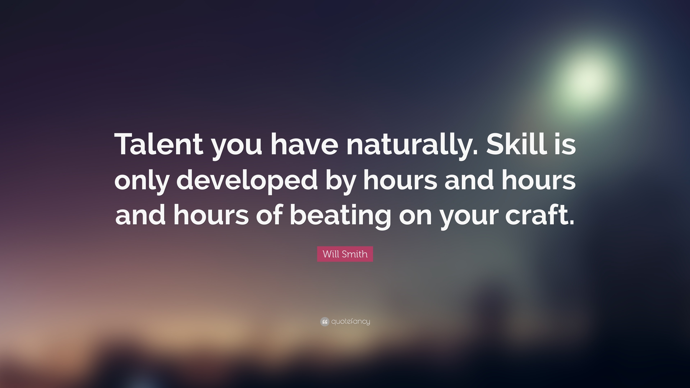

<h1> Hi there, I'm PRAVEENA 👋 </h1>

 
 
<li> 👋 I am honing my dev and dsa skills.</li>
<li> 👀 I’m interested in web development.</li>
<li> 🌱 I’m currently learning to master Frontend .</li>
<li> 💞️ I’m looking to collaborate on frontend projects.</li>
<li> 📫 How to reach me praveenaoffid@gmail.com</li>

 

 

### Languages and Tools:

 
  
 
   
 
 
 
 
